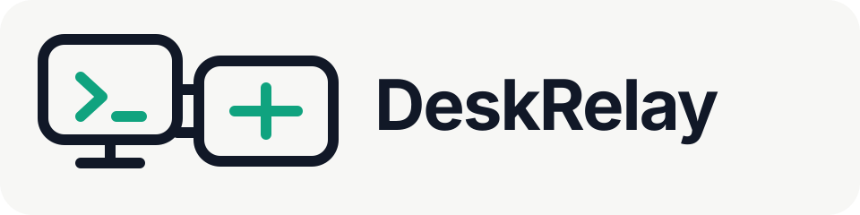
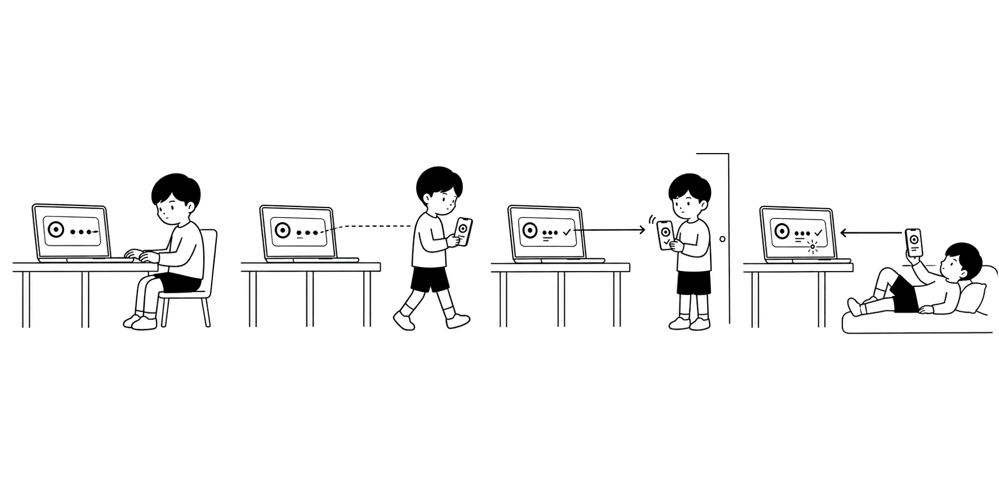
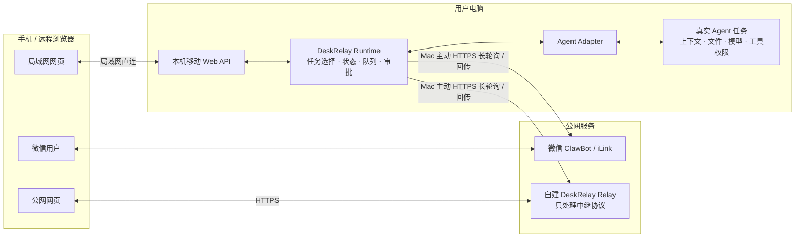

# DeskRelay

<p align="center"><strong>One real session. Every screen.</strong></p>

<p align="center">
  <a href="https://github.com/imsinolam/DeskRelay"></a>
  <a href="https://www.npmjs.com/package/deskrelay"></a>
  
</p>

<p align="center"></p>

DeskRelay 把电脑上真实运行的 AI 编程任务延伸到微信 ClawBot、局域网网页和可选的公网网页。电脑 Agent 始终持有任务上下文、项目文件、模型和工具权限；DeskRelay 只负责把必要的消息、状态和操作可靠地送到同一个任务。

<p align="center"></p>

## 它们是什么关系



图中的“Mac 主动”表示**连接由电脑向外发起**。微信 ClawBot 与公网 Relay 是两条互相独立的链路；公网 Relay 不经过微信，微信也不依赖用户自建服务器。

| 组件 | 负责什么 | 不负责什么 |
| --- | --- | --- |
| 真实 Agent | 持有原任务、上下文、文件、模型、工具和审批状态 | 不复制任务到手机或服务器 |
| Agent Adapter | 连接桌面端、可见 CLI 或供应方共享服务的真实 owner | 不能用隐藏替代会话冒充原任务 |
| DeskRelay Runtime | 选择任务，同步消息、状态、队列、审批、停止和附件 | 不运行模型，不成为第二个 Agent |
| 微信 ClawBot | 快速控制、审批与完成通知 | 不保存独立任务历史 |
| 局域网网页 | 同一网络内完整阅读和操作 | 不跨互联网访问电脑 |
| 公网 Relay | 在公网网页与在线电脑之间暂存并转发 DeskRelay 指令 | 不连接本机端口，不代理任意 URL/TCP/HTTP，不运行 Agent |

三个远程入口最终都进入电脑上的同一个 DeskRelay Runtime，再由对应 Adapter 连接真实任务。电脑离线、Agent 未启动或原任务无法恢复时，远程端必须显示不可用，不能静默创建另一条会话。

## 公网模式为什么不是内网穿透

公网网页模式参考微信 ClawBot 的核心网络原则：**电脑主动连接公网服务，公网服务不主动进入电脑。** 它不是复用微信协议，而是复用这种“出站连接 + 应用层任务中继”的安全架构。

- Mac 主动通过 HTTPS 长轮询获取待处理指令并主动回传结果；
- 不使用 `cloudflared`、SSH `-R`、frp、ngrok 等通用隧道；
- 不把本机 `4396` 或任意 TCP/HTTP 端口直接发布到公网；
- Relay 只接受 DeskRelay 定义的 `/api/` 请求，不能指定任意本机地址、端口或外部 URL；
- 设备身份、浏览器登录、指令 ID、过期时间和本地 journal 分层处理认证与重试去重；
- 项目文件、Agent 凭据和任务 owner 始终留在电脑上，服务器不运行替代 Agent。

HTTPS 保护网络传输，但 Relay 服务器仍属于信任边界：服务器进程在转发期间能够接触任务请求和响应，当前不是端到端加密。公网模式应部署在自己控制且可信的服务器上，限制管理员权限，避免记录正文、Cookie、附件和凭据。完整威胁边界见[公网访问说明](docs/guides/remote-access.md#为什么这种方式比通用内网穿透更安全)。

## 快速开始

需要 Node.js `>= 24`，并已安装、登录至少一个支持的 Agent。

```bash
npm install -g deskrelay
deskrelay-setup
cd /path/to/your/project
deskrelay --adapter codex
```

完成微信扫码后，向 ClawBot 发送“任务”即可选择电脑上的任务；启动时显示的移动网页链接可在手机浏览器打开。Agent 前置安装和单 Agent 调试见[Agent 安装与配置](docs/guides/agent-setup.md)。

不要把扫码结果、setup 链接、移动密码、`~/.deskrelay`、日志、任务 ID 或未脱敏截图提交到 issue。

## 支持的 Agent 与会话一致性

“支持”分为三个层级：能否继续原任务、手机消息能否在电脑端看到、已经打开的任务能否实时同步。

| Agent | 继续原任务 | 电脑端可见 | 当前边界 |
| --- | --- | --- | --- |
| Codex Desktop | 是 | 是，原 Codex 任务实时同步 | 完整桌面端接入 |
| WorkBuddy Desktop | 是 | 是，原 WorkBuddy 任务实时同步 | 完整桌面端接入 |
| Claude Code / TClaude | 是，同一 CLI 会话 | 是，在 DeskRelay 连接的可见终端中 | 不自动接管任意独立终端窗口 |
| OpenCode | 是，同一 OpenCode session | 是，在 DeskRelay 连接的 OpenCode 客户端中 | 本机 server + attach 共享会话 |
| Grok CLI | 是，同一个 Grok leader 会话 | 是，DeskRelay 打开的 Grok 终端实时同步 | 电脑 TUI 与远程入口共用 leader |
| CodeBuddy | 是，同一 `--serve` 任务 | 是，DeskRelay 打开的 CodeBuddy 界面实时同步 | 可见界面与 HTTP ACP 共用 owner |
| reasonix | 是，恢复原 transcript | 是，官方 Web UI 与远程入口实时同步 | 使用 `serve -resume`，不复制历史 |

Shell 是可选命令执行适配器，没有可继续的任务历史，因此不列入会话一致性矩阵。更完整的 owner 模型见[架构与数据流](docs/concepts/architecture.md)。

## 没有服务器与有服务器

| 模式 | 微信 ClawBot | 移动网页 | 连接方式 |
| --- | --- | --- | --- |
| 没有公网服务器 | 可从外网使用 | 仅同一局域网可访问 | Mac 主动连接微信；网页局域网直连 Mac |
| 有公网服务器 | 使用方式不变 | 可通过 HTTPS 公网访问 | Mac 主动连接自建 Relay；服务器不反向连接 Mac |

服务器部署、HTTPS、设备配对和安全配置见[移动网页与公网访问](docs/guides/remote-access.md)。

## 仓库结构

| 目录 | 内容 |
| --- | --- |
| `src/` | Runtime、Agent Adapter、微信、移动网页和 Relay 源码 |
| `bin/` | npm 发布的 `deskrelay-*` 命令入口 |
| `test/` | 与源码模块对应的自动化测试 |
| `docs/` | 面向用户、架构、安全和维护者的分层文档 |
| `deploy/` | Nginx 与 systemd 的参考部署模板 |
| `.github/` | CI、Issue 模板、贡献规范与安全策略 |

根目录只保留 npm、TypeScript、测试和许可证需要的标准文件。`dist/` 与 `node_modules/` 都是本地生成目录，不进入 Git；完整文档导航见 [`docs/README.md`](docs/README.md)。

## DeskRelay 2.0

2.0 将 npm 包统一为 `deskrelay`，公开命令统一为 `deskrelay-*`，活动数据目录统一为 `~/.deskrelay`，环境变量统一使用 `DESKRELAY_*`。旧数据只在首次启动时复制迁移一次，之后不再作为活动目录。迁移表见[运行配置](docs/guides/configuration.md#从-1x-迁移到-20)。

## 文档

- [文档导航](docs/README.md)
- [项目定位](docs/concepts/about.md)
- [架构与数据流](docs/concepts/architecture.md)
- [Agent 安装与配置](docs/guides/agent-setup.md)
- [移动网页与公网访问](docs/guides/remote-access.md)
- [运行配置](docs/guides/configuration.md)
- [问题排查](docs/guides/troubleshooting.md)
- [安全策略](.github/SECURITY.md)
- [贡献指南](.github/CONTRIBUTING.md)

## License

[AGPL-3.0-or-later](LICENSE.txt)
