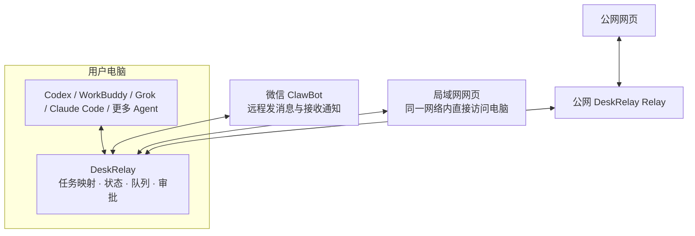

# DeskRelay

<p align="center"><strong>One real session. Every screen.</strong></p>

<p align="center">
  <a href="https://github.com/UNLINEARITY/DeskRelay"></a>
  <a href="https://www.npmjs.com/package/deskrelay"></a>
  
</p>

<p align="center"></p>

DeskRelay 把电脑上的 AI 编程任务延伸到微信 ClawBot、局域网网页和可选的公网网页。对于已经具备“原任务接入”能力的 Agent，远程消息、审批、停止操作和回复都会进入电脑端原来的任务，不会另开隐藏会话。

**电脑 Agent 始终是任务 owner，DeskRelay 和远程界面只是入口；但不同 Agent 当前达到的会话一致性级别并不相同，不能把“命令能接入”都写成“桌面端实时同步”。**

<p align="center"></p>

## 它们是什么关系



| 组成部分 | 负责什么 | 不负责什么 |
| --- | --- | --- |
| 电脑 Agent | 持有真实任务、上下文、项目文件、模型和工具权限 | 不需要把任务复制到手机 |
| DeskRelay | 映射真实任务，在各入口间同步消息、状态、审批和附件 | 不成为第二个 Agent，不创建替代会话 |
| 微信 ClawBot | 随时查看任务、发消息、审批、停止并接收完成通知 | 不保存另一份任务历史 |
| 局域网网页 | 手机与电脑同网时直接访问电脑上的 DeskRelay | 不能跨互联网直接访问本机 |
| 公网网页 | 通过自建 Relay 在外网访问同一任务 | Relay 不运行 Agent，也不开放本机通用端口 |

三个远程入口共享同一个 DeskRelay Runtime，因此不会彼此产生三份历史。至于 Runtime 与电脑 Agent 是否已经做到“同一条任务、电脑端实时可见”，取决于具体适配器，见下方能力矩阵。电脑离线或 Agent 不可用时，远程端必须明确显示不可用，不能静默创建替代会话。

## 快速开始

需要 Node.js `>= 24`，并已安装、登录至少一个支持的 Agent。

```bash
npm install -g deskrelay
deskrelay-setup
cd /path/to/your/project
deskrelay --adapter codex
```

完成微信扫码后，向 ClawBot 发送“任务”即可选择电脑上的真实任务；启动后显示的移动网页链接可在手机浏览器打开。

不要把扫码结果、setup 链接、移动密码、`~/.deskrelay` 或任务截图提交到 issue。

详细的 Agent 前置安装、PATH 检查和单 Agent 调试命令见 [Agent 安装与配置](docs/agent-setup.md)。

## 支持的 Agent 与会话一致性

这里的“支持”不能只表示命令能够启动，需要分清三个能力：

- **继续原任务**：选择已有任务后，手机消息进入同一个任务 ID 和上下文；
- **电脑端可见**：手机消息和 Agent 回复能在对应的电脑界面或可见终端中看到；
- **实时同步**：电脑端已经打开该任务时，无须重新加载就能看到远程变化。

| Agent | 继续原任务 | 电脑端可见 | 当前边界 |
| --- | --- | --- | --- |
| Codex Desktop | 是 | 是，原 Codex 任务实时同步 | 完整桌面端接入 |
| WorkBuddy Desktop | 是 | 是，原 WorkBuddy 任务实时同步 | 完整桌面端接入 |
| Claude Code / TClaude | 是，同一 CLI 会话 | 是，在 DeskRelay 连接的可见终端中 | 不会自动接管任意一个已经独立打开的终端窗口 |
| OpenCode | 是，同一 OpenCode session | 是，在 DeskRelay 连接的 OpenCode 客户端中 | 通过本机 server + attach 共享会话 |
| Grok CLI | 是，同一个 Grok leader 会话 | 是，DeskRelay 打开的 Grok 终端实时同步 | 电脑 TUI 和远程入口连接同一个共享 leader |
| CodeBuddy | 是，同一 CodeBuddy `--serve` 任务 | 是，DeskRelay 打开的 CodeBuddy 界面实时同步 | 可见界面与 HTTP ACP 共用一个 `--serve` owner，不启动独立 `--acp` |
| reasonix | 是，直接恢复原 transcript | 是，官方 reasonix Web UI 与远程入口实时同步 | 使用 `serve -resume` 打开原文件，不复制或转换历史 |

Shell 只是可选的命令执行适配器，不是有任务历史的 Agent，因此不列入会话支持范围。

DeskRelay 的目标是让所有正式 Agent 最终都满足“继续原任务、电脑可见、手机与电脑不分叉”。在达到这个标准前，文档必须明确标注限制，不能只写成笼统的“支持”。DeskRelay 也不分发这些 Agent，不代替它们完成账号、模型或供应商配置。

## 没有服务器与有服务器

| 模式 | 微信 ClawBot | 移动网页 | 连接方向 |
| --- | --- | --- | --- |
| 没有公网服务器 | 可在外网使用 | 仅同一局域网可访问 | Mac 主动连接微信服务；网页直接连接 Mac |
| 有公网服务器 | 使用方式不变 | 可通过 HTTPS 公网访问 | Mac 主动连接 Relay；服务器不反向连接 Mac |

公网模式是**应用层任务中继**：只传输 DeskRelay 所需的消息、状态、审批和附件，不提供任意 TCP/HTTP 转发，也不把本机监听端口直接发布到公网。

服务器部署、HTTPS、设备配对和安全配置见 [移动网页与公网访问](docs/remote-access.md)。

## DeskRelay 2.0 更名说明

2.0 是破坏性品牌迁移：npm 包统一为 `deskrelay`，公开命令统一为 `deskrelay-*`，活动数据目录统一为 `~/.deskrelay`，环境变量统一使用 `DESKRELAY_*`。

旧命令不再发布。首次启动 2.0 时会从旧数据目录一次性复制可迁移的登录和任务状态；旧目录不会继续作为活动目录。完整迁移表见 [运行配置](docs/configuration.md#从-1x-迁移到-20)。

## 文档

- [项目定位](docs/about.md)
- [Agent 安装与配置](docs/agent-setup.md)
- [架构与数据流](docs/architecture.md)
- [运行配置与 2.0 迁移](docs/configuration.md)
- [局域网与公网 Relay](docs/remote-access.md)
- [问题排查](docs/troubleshooting.md)
- [开发与测试](docs/development.md)
- [安全说明](SECURITY.md)
- [对外发布](docs/publishing.md)

## 安全边界

- 不要公开 `~/.deskrelay`、登录凭据、设备密钥、移动访问链接、日志或附件；
- 不要使用通用公网隧道把本机端口直接暴露到互联网；
- 公网 Relay 必须使用 HTTPS、长随机设备密钥、访问认证、请求去重和过期控制；
- 当前私有开发仓库可能含历史隐私，公开前必须从审计后的文件快照创建干净 Git 历史。

## License

[AGPL-3.0-or-later](LICENSE.txt)
