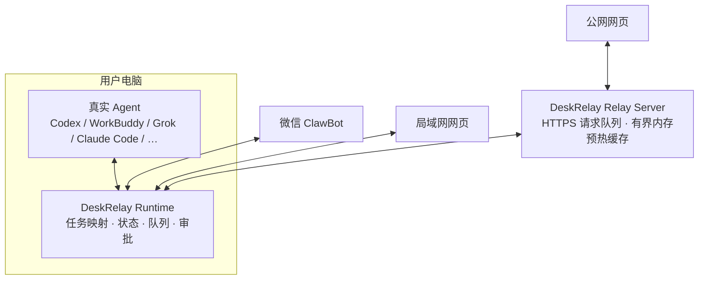

# 架构与数据流

## 总览



DeskRelay 的本机 Runtime 是所有远程入口的汇合点，但**真实 Agent 仍是任务 owner**。Runtime 负责找到任务并连接对应桌面接口、可见 CLI 或供应方共享服务。协议形式不是判断标准；只有远程端与电脑端确实连接同一个 live owner，才能宣称完成原任务同步。

## 组件职责

### 真实 Agent

- 保存任务和上下文；
- 执行模型请求和工具调用；
- 产生运行状态、审批请求和最终回复；
- 决定任务是否可继续。

### DeskRelay Runtime

- 枚举、搜索和选择真实任务；
- 将远程消息提交到已选择任务；
- 同步回复、运行状态、模型、耗时、审批和附件；
- 对消息、完成通知和 Relay 指令做去重；
- 电脑或 Agent 不可用时返回明确错误。

推荐入口是 `deskrelay`，它启动常驻 daemon。`deskrelay-bridge-*` 是单 Agent 调试入口，不能与同一工作目录的 daemon 同时抢占微信连接。

### 微信 ClawBot

ClawBot 是轻量远程控制与通知入口。Mac 主动长轮询微信服务：

```text
微信用户 → ClawBot → Mac 上的 DeskRelay → 真实 Agent
真实 Agent → DeskRelay → ClawBot → 微信用户
```

它不依赖用户自建公网服务器。任务列表序号只用于当前列表导航；真正的任务映射以稳定 task/session ID 为准。

### 局域网网页

移动 Web Server 运行在电脑上。手机与电脑位于可互访的同一局域网时，浏览器直接访问电脑地址，读取同一套任务状态并调用同一套 Runtime。

这条路径延迟最低，但不能在外网直接访问，也不应通过通用反向隧道暴露本机端口。

### 公网网页与 Relay

公网 Relay 部署在用户自己的服务器上。浏览器连接 Relay，Mac 使用带设备认证的 HTTPS 长轮询主动取回请求并提交响应：

```text
公网浏览器 → HTTPS Relay ← HTTPS 长轮询 ← Mac DeskRelay → 真实 Agent
```

服务器不反向连接 Mac，不扫描局域网，也不提供任意 URL/TCP/HTTP 转发。Relay 只理解 DeskRelay 协议中的页面请求、消息、状态、审批和附件。

电脑连接 Relay 后，会主动用设备级只读授权刷新终端状态、全局任务看板、当前终端任务列表和最近任务的消息尾页。Relay 只在有界内存中保存最近一次验证过的响应，使浏览器打开前数据已经准备好；浏览器仍需通过移动端登录会话才能读取，写操作仍必须交给在线电脑。这个预热过程不会创建新的 Agent owner，不会自动打开尚未连接的 Agent，也不能发送消息、审批、停止或新建任务。真实任务、完整上下文和执行权限始终只由电脑端 Agent 持有。

## 同一任务保证

“支持 Agent”分为三类接入：

1. **桌面原生 owner**：Codex、WorkBuddy 直接连接桌面端真实任务，手机消息能在已打开的桌面任务中实时出现；
2. **可见 CLI owner**：Claude Code、TClaude 由 DeskRelay 连接的同一个可见终端持有任务，手机输入、审批、停止和回复都写入该终端；
3. **共享服务 owner**：电脑界面与远程入口共同连接一个长期服务。OpenCode 使用 server + attach，Grok 使用 agent leader，CodeBuddy 使用同一个 `codebuddy --serve` 进程及其 HTTP ACP，reasonix 使用 `serve -resume <原 transcript>` 及官方 Web UI。

适配器只有在能够证明消息、回复、审批和停止都由同一个 live owner 处理时，才能标记为“继续原任务”。相同 sessionId、只读 transcript、复制历史到另一个状态目录，或另启一个 ACP 进程都不足以证明同一任务。CodeBuddy 不再启动独立 `--acp`；reasonix 不再创建历史镜像，原 transcript 无法读取时必须直接报任务不可用。

如果真实 owner 或原会话无法连接，适配器应显示“任务不可用”及恢复方式，禁止静默切到新的独立会话。

## 状态与数据目录

活动运行数据默认位于 `~/.deskrelay`，包括微信登录、同步游标、工作区映射、移动网页认证、日志和附件。这个目录不是项目文件，不能提交到 Git 或上传到公共存储。

2.0 首次启动会从 1.x 数据目录一次性复制可迁移状态。迁移不会覆盖已经存在的 2.0 文件，也不会继续使用旧目录作为活动目录。

## 安全边界

- 本机只监听局域网网页所需端口，不通过通用隧道直接发布到公网；
- 公网 Relay 必须使用 HTTPS、设备配对、长随机密钥、请求过期和去重；
- Relay 不是通用代理，不能读取任意本地文件或调用任意本机端口；
- 远程端只获得用户主动选择的 DeskRelay 任务能力；
- Agent 的实际工具权限仍由电脑端 Agent 和审批策略决定。
