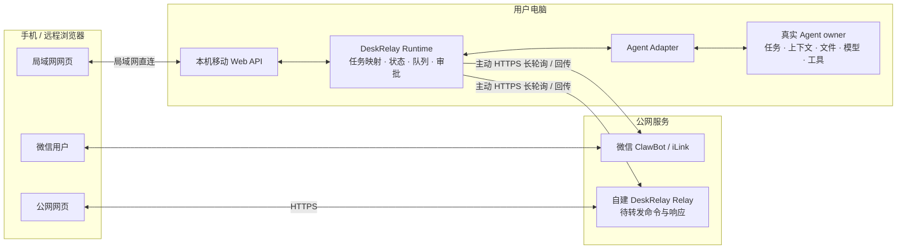

# 架构与数据流

## 总览

DeskRelay 的核心约束是：**电脑上的真实 Agent 是任务唯一 owner，所有远程入口只延伸这条任务。**



这张图同时表达两件事：

1. **业务数据最终进入同一个 Runtime 和真实 Agent owner**；
2. **公网连接由 Mac 主动向外发起**，微信服务和自建 Relay 都不能主动连接 Mac 的本地端口。

微信 ClawBot 与公网 Relay 是两套独立入口。公网网页不经过微信，ClawBot 也不依赖自建 Relay；它们只是采用相同的主动连接原则。

## 组件职责

### 真实 Agent owner

真实 Agent 负责：

- 保存任务 ID、历史和上下文；
- 访问项目目录与本地文件；
- 选择模型、账号和供应商配置；
- 执行工具、发起审批、产生运行状态和回复。

DeskRelay 不能通过复制 transcript、复用相同标题或另起一个 CLI/ACP 进程来冒充原任务。

### Agent Adapter

Adapter 把统一的 DeskRelay 操作映射到不同 Agent 的真实 owner：

- 桌面原生 owner：Codex Desktop、WorkBuddy Desktop；
- 可见 CLI owner：Claude Code、TClaude；
- 共享服务 owner：OpenCode server + attach、Grok leader、CodeBuddy `--serve`、reasonix `serve -resume`。

只有消息、回复、审批、停止和队列都由同一个 live owner 处理时，Adapter 才能声明“继续原任务”。

### DeskRelay Runtime

Runtime 是三个远程入口的本机汇合点，负责：

- 枚举、搜索、选择和新建真实任务；
- 把远程输入提交到当前任务；
- 同步消息、运行状态、模型、耗时、审批、附件和队列；
- 对微信消息、完成通知和公网 Relay 指令去重；
- 在电脑或 Agent 不可用时返回明确错误。

推荐入口是 `deskrelay` 常驻 daemon。`deskrelay-bridge-*` 只用于单 Agent 调试，不能和同工作目录的 daemon 同时争用微信连接。

### 微信 ClawBot

ClawBot 是轻量控制与通知入口：

```text
微信用户 ⇄ 微信 ClawBot / iLink ⇐ Mac 主动长轮询 ⇄ DeskRelay ⇄ 真实 Agent
```

Mac 主动拉取微信消息并主动发送回复，因此用户不需要自建服务器，也不需要开放本机端口。任务列表序号只是当前列表的导航映射，真实任务由稳定 task/session ID 标识。

### 局域网网页

移动 Web API 运行在电脑上。手机与电脑处于可互访的同一网络时，浏览器直接访问局域网地址：

```text
手机浏览器 ⇄ 局域网 HTTP ⇄ Mac 移动 Web API ⇄ DeskRelay ⇄ 真实 Agent
```

这条路径延迟最低，但仅适用于局域网。不要用通用反向隧道把它直接变成公网入口。

### 公网网页与 Relay

公网模式参考 ClawBot 的连接结构：Mac 主动向公网服务发起 HTTPS 长轮询，而不是服务器反向进入 Mac。

```text
公网浏览器 ⇄ HTTPS ⇄ 自建 Relay ⇐ Mac 主动 HTTPS 长轮询 / 回传 ⇄ DeskRelay ⇄ 真实 Agent
```

Relay 的职责被限制在 DeskRelay 应用协议内：

- 接收浏览器对 DeskRelay `/api/` 的请求；
- 生成带 ID 和过期时间的待处理指令；
- 等待已认证的 Mac 主动取走指令；
- 接收 Mac 主动回传的响应；
- 默认只在内存中保存尚未完成的命令和响应。

Relay 不提供任意 TCP 转发、端口映射、URL 代理或局域网扫描，也不运行 Agent。它不能指定新的 `localBaseUrl`，不能要求 Mac 访问任意主机或本机端口。

## 三条入口的数据路径

| 入口 | 公网中间服务 | 谁发起到公网的连接 | 是否暴露 Mac 端口 |
| --- | --- | --- | --- |
| 微信 ClawBot | 微信 iLink | Mac | 否 |
| 局域网网页 | 无 | 手机在局域网直连 | 只在局域网监听 |
| 公网网页 | 用户自建 Relay | Mac | 否 |

三条路径最终都调用同一个本机 Runtime。它们不会各自保存一套 Agent 历史，也不应在真实任务不可用时自动降级到隐藏会话。

## 同一任务保证

以下信号不足以单独证明“同一任务”：

- sessionId 字符串相同；
- 能读取历史 transcript；
- 把历史复制到新的状态目录；
- 新进程使用相同项目目录；
- 远程网页展示了相同任务标题。

完整保证需要验证：

1. 远程消息进入原 owner；
2. 电脑端能够看到这条消息；
3. 回复、审批、停止和队列属于同一 owner；
4. owner 不可用时明确失败，不启动替代会话。

## 公网安全模型

### 相比通用内网穿透减少了什么风险

- 服务器没有到 Mac 的通用网络入口；
- Mac 的移动网页端口不会被映射到公网；
- Relay 只能表达 DeskRelay 应用指令，不能转发任意目标；
- 设备身份与浏览器身份分离；
- 指令包含 ID 和有效期，非幂等操作由本地 journal 去重；
- Agent 权限仍由电脑端 owner 和审批机制决定。

### 仍然需要信任什么

公网 Relay 不是端到端加密存储。HTTPS 保护链路，但 Relay 在转发期间可以接触请求和响应内容；拥有服务器 root 权限或控制 Relay 进程的人理论上能够读取这些内容。因此：

- 只部署到自己控制且可信的服务器；
- Relay 内部端口只绑定回环地址，公网只开放 HTTPS；
- 不记录 Cookie、正文、附件、setup 参数和设备凭据；
- 设备密钥与移动密码分离并定期轮换；
- 对服务器、依赖和反向代理及时更新；
- 高敏感任务优先使用局域网模式。

详细部署与验收见[移动网页与公网访问](../guides/remote-access.md)。

## 状态与数据目录

活动数据默认位于 `~/.deskrelay`，包括微信登录、同步游标、工作区映射、移动认证、日志和附件。它不是项目目录，不能提交到 Git 或上传到公共存储。

2.0 首次启动会从旧数据目录一次性复制可迁移状态；迁移不会覆盖已经存在的 2.0 文件，也不会继续使用旧目录作为活动目录。
